# 🍸 ร้านจ๊าบบาร์ (JABB BAR) — Knowledge Base & Technical Documentation

ยินดีต้อนรับสู่ **Obsidian Vault** สำหรับระบบเว็บแอปพลิเคชันจัดการและนับสต็อกสินค้าเครื่องดื่มของ **ร้านจ๊าบบาร์** เอกสารชุดนี้รวบรวมข้อกำหนดความต้องการระบบ (SRS), สถาปัตยกรรมระบบ (System Architecture), การออกแบบฐานข้อมูล (Database Schema) และคู่มือการปฏิบัติงานสำหรับนักพัฒนาและผู้ดูแลระบบอย่างสมบูรณ์

---

## 🗺️ แผนผังเอกสารใน Vault (Navigation Map)

```mermaid
graph TD
    Root["🍸 Jabb Bar Knowledge Base"]
    
    Root --> SRS["10 - SRS (Software Requirements)"]
    SRS --> SRS1["[[10.1 - Project Scope & Objectives]]"]
    SRS --> SRS2["[[10.2 - Functional Requirements (FR)]]"]
    SRS --> SRS3["[[10.3 - Non-Functional Requirements (NFR)]]"]
    SRS --> SRS4["[[10.4 - Initial Mockup Drinks Catalog]]"]

    Root --> Arch["20 - System Architecture"]
    Arch --> Arch1["[[20.1 - Architecture Overview]]"]
    Arch --> Arch2["[[20.2 - Frontend Architecture (React + Vite)]]"]
    Arch --> Arch3["[[20.3 - Backend Architecture (Node.js + Express)]]"]
    Arch --> Arch4["[[20.4 - Docker & Container Orchestration]]"]

    Root --> DB["30 - Database & Data Models"]
    DB --> DB1["[[30.1 - Entity-Relationship Diagram (ERD)]]"]
    DB --> DB2["[[30.2 - Data Dictionary & Tables]]"]
    DB --> DB3["[[30.3 - Prisma ORM & Transaction Design]]"]

    Root --> Ops["40 - Operations & Guides"]
    Ops --> Ops1["[[40.1 - Daily Stock Counting & Shift Closing]]"]
    Ops --> Ops2["[[40.2 - Docker Operations & Troubleshooting]]"]
```

---

## 📑 สรุปหมวดหมู่เนื้อหาหลัก

### 1. [[10.1 - Project Scope & Objectives|ข้อกำหนดความต้องการซอฟต์แวร์ (SRS)]]
- **เป้าหมายและขอบเขต:** ระบบนับสต็อกแบบเรียลไทม์ โหมดกลางคืน (Dark Mode) สำหรับบาร์แสงสลัว
- **สมการคำนวณ:** $(C) = หน้า + หลัง$, $(D) = หน้า + หลัง$, $(E) = (C) - (D)$
- **ตรรกะแจ้งเตือน:** ตรวจจับเมื่อยอดเปิดร้าน $(C) \neq (A) + (B)$
- **Next Day Shift:** ระบบยกยอดคงเหลือร้านปิด $(D)$ ไปเป็นยอดยกมา $(A)$ ของวันใหม่
- **รายการสินค้าตั้งต้น:** 41 รายการ ครอบคลุม วิสกี้, บรั่นดี, เหล้าไทย, เบียร์, โซจู, ไวน์, มิกเซอร์

### 2. [[20.1 - Architecture Overview|สถาปัตยกรรมระบบ (System Architecture)]]
- **Multi-tier Containerized Stack:**
  - **Frontend:** React 19 + Vite 6 + Tailwind CSS (Nginx Alpine)
  - **Backend:** Node.js + Express.js API
  - **Database:** PostgreSQL 16 (ผ่าน Prisma ORM)
  - **Containerization:** Docker Compose รันทั้งระบบในคำสั่งเดียว
- **Reverse Proxy & Networking:** การสื่อสารภายในวงเครือข่าย Docker `jabb_network`

### 3. [[30.1 - Entity-Relationship Diagram (ERD)|การออกแบบฐานข้อมูล (Database Schema)]]
- **โมเดลข้อมูล (Entity-Relationship):**
  - `DrinkItem`: รายการสินค้าและตัวเลขสต็อกปัจจุบัน
  - `DailyShift`: ประวัติการปิดยอดประจำกะ
  - `ShiftRecord`: สแนปช็อตบันทึกยอดขายรายขวดในแต่ละกะ
- **Database Transactions:** รับประกันความสอดคล้องของข้อมูลด้วย Prisma `$transaction`

### 4. [[40.1 - Daily Stock Counting & Shift Closing|คู่มือและการปฏิบัติงาน (Operations & Guides)]]
- ขั้นตอนการนับสต็อกประจำวันของบาร์เทนเดอร์
- วิธีการแก้ไขจุดเตือนยอดไม่ตรง (Warning Resolution)
- การส่งออกรายงานเข้ากลุ่มไลน์ (LINE Report) และดาวน์โหลด Excel CSV
- คำสั่ง Docker Compose สำหรับ Deploy และบำรุงรักษา

---

## ⚡ ข้อมูลด่วนของระบบ (Quick Specs)

| หัวข้อ | รายละเอียด |
| :--- | :--- |
| **Project Name** | ร้านจ๊าบบาร์ สต็อกเครื่องดื่ม (Jabb Bar Inventory) |
| **Frontend Port** | `5173` (Vite) / `80` (Nginx Docker) |
| **Backend Port** | `5000` (Node.js Express) |
| **Database Port** | `5432` (PostgreSQL 16) |
| **GitHub Repo** | [Aecomputerengineer01/Jabb_Bar](https://github.com/Aecomputerengineer01/Jabb_Bar) |
| **Live Pages URL** | [aecomputerengineer01.github.io/Jabb_Bar/](https://aecomputerengineer01.github.io/Jabb_Bar/) |
