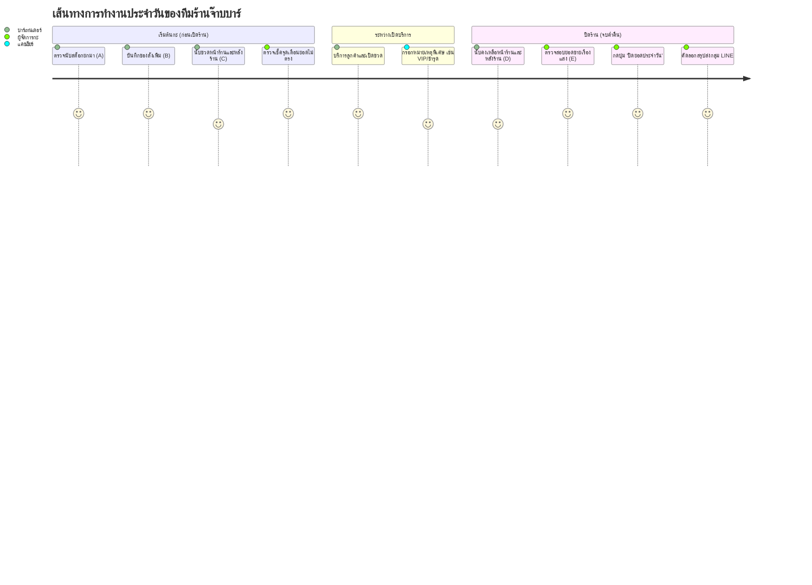

# 10.1 - ขอบเขตและวัตถุประสงค์ของโครงการ (Project Scope & Objectives)

[[00 - Index|⬅️ กลับสู่หน้าหลัก]] | [[10.2 - Functional Requirements (FR)|ถัดไป: ข้อกำหนดเชิงฟังก์ชัน ➡️]]

---

## 1. บทนำและภูมิหลัง (Introduction & Background)

ร้าน **"จ๊าบบาร์ (JABB BAR)"** เป็นสถานบันเทิงยามค่ำคืนที่ให้บริการเครื่องดื่มแอลกอฮอล์และไม่มีแอลกอฮอล์หลากหลายชนิด ในแต่ละวันมีการหมุนเวียนของสินค้าจำนวนมาก ทั้งการนำสต็อกเดิมมายกยอด, การรับสินค้าใหม่เข้ามาเสริม, การกระจายสต็อกไว้ตามจุดขายหน้าร้าน (บาร์หลัก) และสต็อกสำรองหลังร้าน (ห้องเก็บของ)

เดิมทีการตรวจนับสต็อกทำบนกระดาษหรือสมุดจด ซึ่งพบปัญหาหลักดังนี้:
1. **สภาพแวดล้อมแสงน้อย:** ร้านบาร์เปิดไฟสลัว พนักงานอ่านหรือจดตัวเลขบนกระดาษผิดพลาดบ่อยครั้ง
2. **ความคลาดเคลื่อนในการคำนวณ:** การบวกเลขหน้าร้าน+หลังร้าน และการลบหายอดขายใช้เวลานานและมีโอกาสตกหล่น
3. **การส่งต่อกะล่าช้า:** การคำนวณยอดคงเหลือร้านปิดเพื่อยกยอดไปเป็นยอดยกมาของวันถัดไปต้องเขียนซ้ำซ้อนทุกวัน
4. **ความยุ่งยากในการสรุปรายงาน:** ผู้จัดการร้านต้องนำตัวเลขมาพิมพ์สรุปส่งกลุ่ม LINE อีกรอบหลังปิดร้าน

---

## 2. วัตถุประสงค์ของระบบ (Project Objectives)

1. **สร้างระบบตรวจนับสต็อกแบบเรียลไทม์ (Real-time Stock Management Web App)**
   - ออกแบบ UI แบบ **Dark Mode สไตล์ Nightlife Bar** ที่สบายตา ไม่แยงตา และมองเห็นตัวเลขชัดเจนในที่มืด
2. **ขจัดข้อผิดพลาดในการคำนวณด้วย Auto-Calculation**
   - คำนวณยอดเปิดร้าน $(C)$, ยอดปิดร้าน $(D)$ และยอดขาย $(E)$ ให้ทันทีเมื่อพิมพ์ตัวเลข
3. **ตรวจจับความผิดปกติของสต็อกด้วย Data Validation**
   - แสดงไอคอนแจ้งเตือน ⚠️ ทันทีหากยอดนับเปิดร้าน $(C)$ ไม่ตรงกับยอดคำนวณทางทฤษฎี $(A + B)$
4. **ลดระยะเวลาการปิดกะด้วย Next Day Shift Button**
   - กดปุ่มเดียวเพื่อโอนย้ายยอดคงเหลือปิดร้าน $(D)$ ไปเป็นยอดยกมา $(A)$ ของวันใหม่ และล้างค่าช่องอื่นโดยอัตโนมัติ
5. **รองรับอุปกรณ์พกพาสูงสุด (Mobile & Tablet First)**
   - ใช้งานได้คล่องตัวบน Smartphone (มือเดียว) และแท็บเล็ตแคชเชียร์ (iPad) ด้วยตารางเลื่อนแนวนอนแบบตรึงคอลัมน์ (Sticky Columns)
6. **ส่งออกรายงานเข้า LINE ในคลิกเดียว (Instant LINE Reporting)**
   - สรุปยอดขายแยกรายขวดพร้อมก๊อปปี้ส่งเข้ากลุ่ม LINE เจ้าของร้านได้ทันที

---

## 3. กลุ่มผู้ใช้งานเป้าหมาย (Target User Personas)

| ผู้ใช้งาน (Persona) | บทบาทและหน้าที่ในระบบ | อุปกรณ์หลักที่ใช้งาน |
| :--- | :--- | :--- |
| **บาร์เทนเดอร์ / พนักงานบาร์** | เดินนับขวดเครื่องดื่มหน้าร้านและหลังร้าน, ป้อนตัวเลข | สมาร์ทโฟน (iPhone/Android) |
| **แคชเชียร์ / ผู้ช่วยผู้จัดการ** | ตรวจสอบยอดรวมเปิดร้าน, บันทึกรายการสั่งเพิ่ม, ตรวจสอบจุดเตือน | แท็บเล็ต (iPad) หรือ POS |
| **ผู้จัดการร้าน / เจ้าของร้าน** | ตรวจสอบยอดขายรวม $(E)$, กดปิดยอดกะ, รับรายงานสรุปทาง LINE | แท็บเล็ต / สมาร์ทโฟน / คอมพิวเตอร์ |

---

## 4. ขอบเขตของระบบ (System Scope)

### สิ่งที่ระบบครอบคลุม (In Scope):
- ระบบบันทึกสต็อก 41 รายการเครื่องดื่มตั้งต้น
- การคำนวณสมการแบบ Real-time Client-Side
- การตรวจสอบความสมดุลของสต็อกเปิดร้าน $(A + B = C)$
- ปุ่มปิดยอดประจำวัน (Next Day Shift) แบบ Atomic Database Transaction
- การจัดเก็บข้อมูลแบบ Dual-Layer: LocalStorage + PostgreSQL
- โหมดแสดงผลแบบสลับได้: **Table View (ตาราง)** และ **Mobile Card View (การ์ดนับเร็ว)**
- ระบบส่งออกรายงาน: LINE Formatted Text, Excel CSV (UTF-8 BOM), Print/PDF
- การบรรจุ Containerization ผ่าน Docker Compose

### สิ่งที่อยู่นอกขอบเขตในเฟสนี้ (Out of Scope):
- ระบบตัดเงินบัตรเครดิตหรือ Payment Gateway (ระบบมุ่งเน้นการนับสต็อกขวด)
- ระบบเชื่อมต่อเครื่องยิงบาร์โค้ดฮาร์ดแวร์ภายนอก (เน้นการนับและกรอกผ่านทัชสกรีน)
