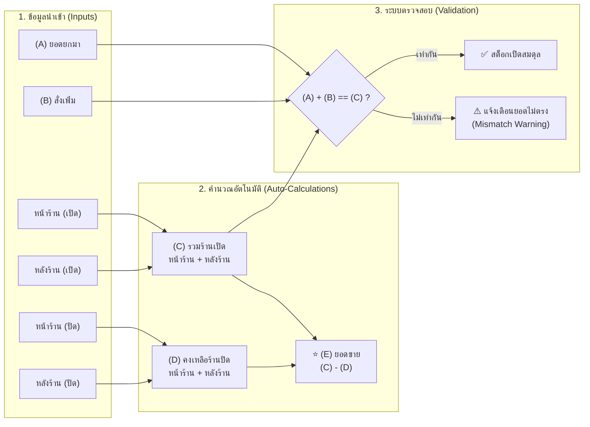
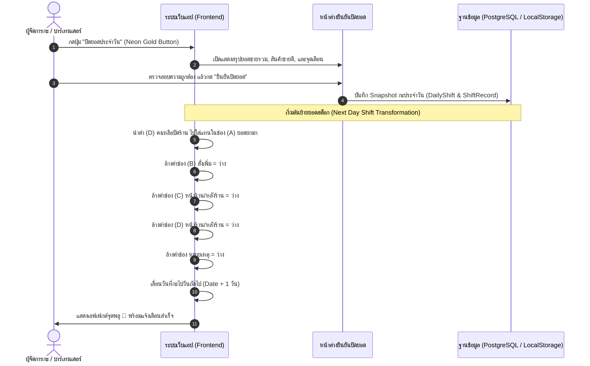

# 10.2 - ข้อกำหนดเชิงฟังก์ชัน (Functional Requirements - FR)

[[10.1 - Project Scope & Objectives|⬅️ ก่อนหน้า: ขอบเขตโครงการ]] | [[10.3 - Non-Functional Requirements (NFR)|ถัดไป: ข้อกำหนดเชิงคุณภาพ ➡️]]

---

## 1. ตารางโครงสร้างข้อมูลและฟิลด์ (Data Columns Specification)

ระบบต้องมีคอลัมน์และช่องกรอกข้อมูลตามลำดับดังต่อไปนี้:

| ลำดับฟิลด์ | ชื่อฟิลด์ (ไทย) | Field Name (EN) | ประเภทข้อมูล (Type) | หน้าที่และการทำงาน |
| :---: | :--- | :--- | :--- | :--- |
| **1** | **ลำดับ** | No. | ตัวเลข (Integer) | เลขลำดับของรายการ ตรึงอยู่กับที่เมื่อเลื่อนตาราง (Sticky Column) |
| **2** | **รายการ** | Item Name | ข้อความ (String) | ชื่อเครื่องดื่ม ตรึงอยู่กับที่ (Sticky Column) พร้อม Badge แสดงหมวดหมู่ |
| **3** | **(A) ยอดยกมา** | Brought Forward | ตัวเลข (Numeric Input) | สต็อกคงเหลือเดิมที่ยกมาจากรอบก่อนหน้า |
| **4** | **(B) สั่งเพิ่ม** | Added | ตัวเลข (Numeric Input) | จำนวนสินค้าที่รับเข้ามาใหม่ในระหว่างกะ |
| **5** | **(C) รวมร้านเปิด** | Total Open | คำนวณอัตโนมัติ (Computed) | มี 2 ช่องย่อย: **หน้าร้าน** และ **หลังร้าน** $$\mathbf{(C) = หน้าร้าน + หลังร้าน}$$ |
| **6** | **(D) คงเหลือร้านปิด** | Total Close | คำนวณอัตโนมัติ (Computed) | มี 2 ช่องย่อย: **หน้าร้าน** และ **หลังร้าน** $$\mathbf{(D) = หน้าร้าน + หลังร้าน}$$ |
| **7** | **(E) ขาย** | Sold | คำนวณอัตโนมัติ (Computed) | ไฮไลท์เรืองแสง Neon Emerald $$\mathbf{(E) = (C) - (D)}$$ |
| **8** | **หมายเหตุ** | Remark | ข้อความ (Text Input) | บันทึกข้อความเพิ่มเติม เช่น "เปิด VIP", "แตกชำรุด", "ขวดแถม" |

---

## 2. ตรรกะและสมการคำนวณอัตโนมัติ (Auto-Calculation Logic)

### รายละเอียดสมการ:
1. **สมการรวมร้านเปิด (Total Open):**
   $$(C) = C_{front} + C_{back}$$
   - เมื่อผู้ใช้พิมพ์ตัวเลขในช่อง `หน้าร้าน` หรือ `หลังร้าน` ระบบจะรวมผลลัพธ์เป็นค่า $(C)$ ทันทีแบบ Real-time
2. **สมการคงเหลือร้านปิด (Total Close):**
   $$(D) = D_{front} + D_{back}$$
   - เมื่อผู้ใช้พิมพ์ตัวเลขในช่อง `หน้าร้าน` หรือ `หลังร้าน` ระบบจะรวมผลลัพธ์เป็นค่า $(D)$ ทันที
3. **สมการยอดขาย (Sold Units):**
   $$(E) = (C) - (D)$$
   - นำยอดรวมเปิดร้าน $(C)$ ลบด้วยยอดคงเหลือปิดร้าน $(D)$ เพื่อหายอดจำนวนขวดที่ขายไปในค่ำคืนนั้น

---

## 3. ระบบตรวจสอบความถูกต้องของข้อมูล (FR-03: Data Validation)

- **เงื่อนไขการตรวจสอบ (Condition):**
  $$\text{Expected Open} = A + B$$
  $$\text{Actual Open} = C$$
  $$\text{Mismatch Diff} = C - (A + B)$$
- **พฤติกรรมของระบบ (System Behavior):**
  - หากมีการกรอกข้อมูลในช่องสต็อกเปิดร้าน และค่า $C \neq (A + B)$:
    1. ระบบจะแสดง **ไอคอนแจ้งเตือนสีส้มแดง ⚠️ (Warning)** บริเวณกล่องผลรวม $(C)$ ทันที
    2. พื้นหลังแถวจะเปลี่ยนเป็นสีแดงจาง (`bg-rose-950/20`) เพื่อให้สังเกตเห็นได้ง่าย
    3. เมื่อนำเมาส์ชี้หรือแตะที่ไอคอน จะแสดง Tooltip แจ้งผลต่างอย่างชัดเจน เช่น:
       - *ยอดเกิน:* `+1` (ยอดนับจริงมากกว่าสต็อกที่มี)
       - *ยอดขาด:* `-2` (ขวดเหล้าอาจหายไปก่อนเปิดร้าน)
    4. ตัวเลขบนการ์ดสรุปด้านบน **"จุดเตือนยอดไม่ตรง"** จะนับจำนวนรายการที่มีปัญหาขึ้นมาอัตโนมัติ

---

## 4. ระบบปิดยอดประจำวัน (FR-04: Next Day Shift)

ฟังก์ชันการปิดกะทำงานเพื่อส่งต่อสต็อกไปยังวันถัดไป มีขั้นตอนการทำงานดังนี้:

---

## 5. การสลับโหมดการแสดงผล (FR-05: Dual View Mode)

1. **โหมดตาราง (Table View):**
   - เหมาะสำหรับ iPad, แท็บเล็ตแคชเชียร์, หรือหน้าจอคอมพิวเตอร์
   - แสดงคอลัมน์ครบถ้วน เลื่อนในแนวนอนได้โดยที่คอลัมน์ `#` และ `รายการเครื่องดื่ม` จะตรึงอยู่กับที่ (Sticky)
   - มีแถวสรุปผลรวมท้ายตาราง (Total Footer)
2. **โหมดการ์ดนับเร็วบนมือถือ (Mobile Cards View):**
   - เหมาะสำหรับการถือสมาร์ทโฟนเดินนับขวดในร้านที่มีแสงน้อย
   - แยกแต่ละเครื่องดื่มเป็นการ์ดขนาดใหญ่
   - มีปุ่ม **`[ - ]`** และ **`[ + ]`** ข้างช่องนับหน้าร้านและหลังร้าน แตะเพื่อเพิ่ม/ลดจำนวนได้ด้วยมือเดียว
   - ช่อง **(E) ขาย** แสดงเด่นชัดขนาดใหญ่พิเศษพร้อมไอคอนไฟ 🔥

---

## 6. การรายงานและส่งออกข้อมูล (FR-06: Reporting & Export)

1. **Instant LINE Report:**
   - กดปุ่ม **"ส่งสรุป LINE"** ระบบจะจัดรูปแบบข้อความสรุปยอดขาย วันที่ เวลา รายการที่ขายได้ และรายการที่ยอดไม่ตรง พร้อมคัดลอกลง Clipboard ทันที
2. **Excel CSV Export:**
   - ส่งออกไฟล์ CSV พร้อมฝัง **UTF-8 BOM (`\uFEFF`)** เปิดใน Microsoft Excel บน Windows ได้ทันทีโดยไม่เป็นภาษาต่างดาว
3. **Print / PDF Slip:**
   - มีชุดสไตล์ `@media print` จัดรูปแบบเอกสารสรุปสต็อกสำหรับพิมพ์ผ่านเครื่องพิมพ์เทอร์มัลหรือบันทึกเป็น PDF
