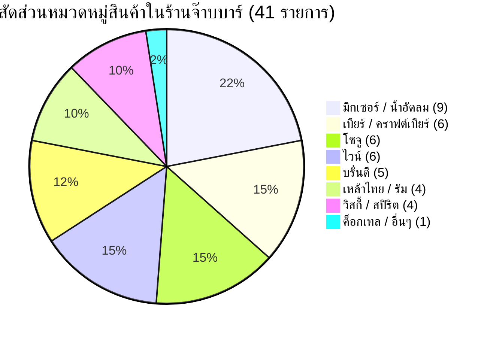

# 10.4 - แคตตาล็อกสินค้าเครื่องดื่มตั้งต้น 41 รายการ (Initial Drinks Catalog)

[[10.3 - Non-Functional Requirements (NFR)|⬅️ ก่อนหน้า: ข้อกำหนดเชิงคุณภาพ]] | [[20.1 - Architecture Overview|ถัดไป: สถาปัตยกรรมระบบ ➡️]]

---

## 1. ตารางแสดงรายการเครื่องดื่มตั้งต้น (41 Items Breakdown)

รายการเครื่องดื่มทั้งหมดที่กำหนดไว้ในความต้องการของระบบร้านจ๊าบบาร์ ได้รับการจัดหมวดหมู่และกำหนดค่าเริ่มต้นลงในทั้ง **Mockup Seed Data** และ **PostgreSQL Database**:

| ลำดับ (#) | ชื่อรายการเครื่องดื่ม | หมวดหมู่ (Category) | ไอคอน | หน่วยนับ | ยกมาเริ่มต้น (A) |
| :---: | :--- | :--- | :---: | :---: | :---: |
| **1** | แบล็ค (Black Label) | วิสกี้ / สปิริต (whisky) | 🥃 | ขวด | 6 |
| **2** | เรด (Red Label) | วิสกี้ / สปิริต (whisky) | 🥃 | ขวด | 8 |
| **3** | รีเจนซี่ แบน | บรั่นดี (brandy) | 🏺 | ขวด | 12 |
| **4** | รีเจนซี่ กลม | บรั่นดี (brandy) | 🏺 | ขวด | 6 |
| **5** | GRANDE | บรั่นดี (brandy) | 🏺 | ขวด | 4 |
| **6** | เมอริเดียน กลม | บรั่นดี (brandy) | 🏺 | ขวด | 5 |
| **7** | เมอริเดียน แบน | บรั่นดี (brandy) | 🏺 | ขวด | 6 |
| **8** | แสงโสม กลม | เหล้าไทย / รัม (thai_spirit) | 🍶 | ขวด | 10 |
| **9** | แสงโสม แบน | เหล้าไทย / รัม (thai_spirit) | 🍶 | ขวด | 8 |
| **10** | หงษ์ทอง กลม | เหล้าไทย / รัม (thai_spirit) | 🍶 | ขวด | 8 |
| **11** | Kimton | วิสกี้ / สปิริต (whisky) | 🥃 | ขวด | 4 |
| **12** | Mountain King | วิสกี้ / สปิริต (whisky) | 🥃 | ขวด | 3 |
| **13** | Silver แบน | เหล้าไทย / รัม (thai_spirit) | 🍶 | ขวด | 4 |
| **14** | Honney Conti | ไวน์ (wine) | 🍷 | ขวด | 5 |
| **15** | Schneider | เบียร์ (beer) | 🍺 | ขวด | 12 |
| **16** | สิงห์ | เบียร์ (beer) | 🍺 | ขวด | 24 |
| **17** | สิงห์Resere | เบียร์ (beer) | 🍺 | ขวด | 12 |
| **18** | ลีโอ | เบียร์ (beer) | 🍺 | ขวด | 36 |
| **19** | สไปรท์ | มิกเซอร์ / น้ำอัดลม (mixer) | 🥤 | กระป๋อง | 24 |
| **20** | โค้ก | มิกเซอร์ / น้ำอัดลม (mixer) | 🥤 | กระป๋อง | 30 |
| **21** | น้ำเปล่า | มิกเซอร์ / น้ำอัดลม (mixer) | 🥤 | ขวด | 48 |
| **22** | โซดา | มิกเซอร์ / น้ำอัดลม (mixer) | 🥤 | ขวด | 48 |
| **23** | Oishi | มิกเซอร์ / น้ำอัดลม (mixer) | 🥤 | กล่อง/ขวด | 15 |
| **24** | สิงห์เลมอนโซดา | มิกเซอร์ / น้ำอัดลม (mixer) | 🥤 | กระป๋อง | 18 |
| **25** | PINKเลมอนโซดา | มิกเซอร์ / น้ำอัดลม (mixer) | 🥤 | กระป๋อง | 18 |
| **26** | โซจูพีช | โซจู (soju) | 🍾 | ขวด | 10 |
| **27** | โชจูสตรอว์เบอรี่ | โซจู (soju) | 🍾 | ขวด | 10 |
| **28** | โซจูเจลลี่ | โซจู (soju) | 🍾 | ขวด | 8 |
| **29** | โซจูโยเกิร์ต | โซจู (soju) | 🍾 | ขวด | 8 |
| **30** | ไวน์Charles Strong | ไวน์ (wine) | 🍷 | ขวด | 4 |
| **31** | ไวน์Laughing Bird | ไวน์ (wine) | 🍷 | ขวด | 4 |
| **32** | ไวน์RUMOURS DRY | ไวน์ (wine) | 🍷 | ขวด | 3 |
| **33** | ไวน์HAUT LAPON | ไวน์ (wine) | 🍷 | ขวด | 3 |
| **34** | ไวน์Moton Cadet | ไวน์ (wine) | 🍷 | ขวด | 3 |
| **35** | โซจูมีเฮ Red Sherbet | โซจู (soju) | 🍾 | ขวด | 6 |
| **36** | โซจูSoRA | โซจู (soju) | 🍾 | ขวด | 6 |
| **37** | Snowy | เบียร์ (beer) | 🍺 | กระป๋อง | 12 |
| **38** | ไฮเนเกน 0% | เบียร์ไม่มีแอลกอฮอล์ (beer) | 🍺 | กระป๋อง | 8 |
| **39** | Cocktallซัมเมอร์เบอร์รี่ | ค็อกเทล / RTD (other) | 🍹 | ขวด | 10 |
| **40** | Fanta Graye (แฟนต้าองุ่น) | มิกเซอร์ / น้ำอัดลม (mixer) | 🥤 | กระป๋อง | 15 |
| **41** | Root beer (รูทเบียร์) | มิกเซอร์ / น้ำอัดลม (mixer) | 🥤 | กระป๋อง | 12 |

---

## 2. การจัดหมวดหมู่สินค้า (Drink Categories Taxonomy)

ระบบจัดกลุ่มเครื่องดื่มออกเป็น 8 หมวดหมู่หลัก เพื่อความสะดวกในการกรอง (Filter Pills) บนหน้าเว็บ:

