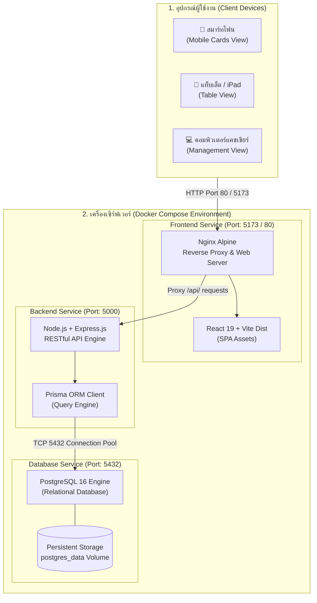
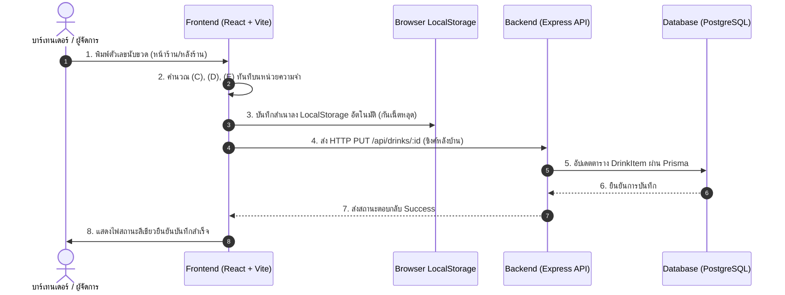

# 20.1 - ภาพรวมสถาปัตยกรรมระบบ (System Architecture Overview)

[[10.4 - Initial Mockup Drinks Catalog|⬅️ ก่อนหน้า: แคตตาล็อกสินค้า]] | [[20.2 - Frontend Architecture (React + Vite)|ถัดไป: สถาปัตยกรรมฝั่ง Frontend ➡️]]

---

## 1. ผังโครงสร้างระบบโดยรวม (High-Level System Topology)

ระบบจัดการสต็อกร้านจ๊าบบาร์ ถูกออกแบบตามรูปแบบ **Containerized Three-Tier Architecture** ซึ่งแยกการทำงานของแต่ละส่วนออกจากกันอย่างชัดเจน (Decoupled Components) เพื่อให้ง่ายต่อการพัฒนา ดูแลรักษา และขยายระบบในอนาคต:

---

## 2. การแบ่งหน้าที่ของแต่ละเลเยอร์ (Component Responsibilities)

### 1. Presentation Tier (Frontend):
- **เทคโนโลยี:** React 19, Vite 6, Tailwind CSS 3.4, Lucide Icons
- **หน้าที่:**
  - จัดการส่วนติดต่อผู้ใช้ (UI) ธีม Dark Mode ให้สอดคล้องกับบรรยากาศร้านบาร์
  - ประมวลผลสมการคำนวณแบบ Real-time บนฝั่งไคลเอนต์ (Instant Feedback)
  - รองรับการทำงานแบบ Offline-First ด้วย Local Storage
  - สื่อสารกับฝั่งเซิร์ฟเวอร์ผ่าน `apiClient` (Fetch API)

### 2. Application Tier (Backend):
- **เทคโนโลยี:** Node.js (v20), Express.js 4, CORS, Dotenv
- **หน้าที่:**
  - ให้บริการ RESTful API Endpoints (`/api/drinks`, `/api/shift/close`, `/api/seed`)
  - จัดการกฎทางธุรกิจ (Business Logic) และความปลอดภัยของข้อมูล
  - ควบคุมการปิดกะแบบ **Atomic Database Transaction** (รับประกันว่าสต็อก D จะถูกยกไปเป็น A พร้อมบันทึกประวัติกะโดยไม่มีข้อมูลสูญหาย)

### 3. Data Tier (Database):
- **เทคโนโลยี:** PostgreSQL 16 Alpine, Prisma ORM 6
- **หน้าที่:**
  - จัดเก็บข้อมูลรายการสินค้า, ตัวเลขสต็อกย้อนหลัง และสแนปช็อตการปิดกะ
  - บันทึกข้อมูลลง Docker Volume (`postgres_data`) เพื่อป้องกันข้อมูลสูญหายเมื่อหยุดหรือรีสตาร์ต Container

---

## 3. แผนผังการไหลของข้อมูล (Data Flow Diagram - DFD)

