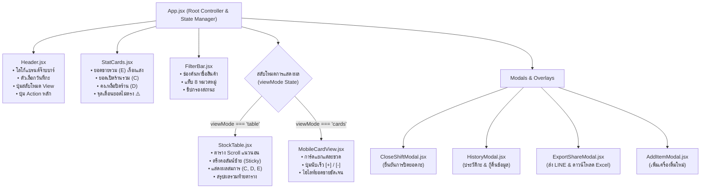

# 20.2 - สถาปัตยกรรมฝั่ง Frontend (React + Vite + Tailwind CSS)

[[20.1 - Architecture Overview|⬅️ ก่อนหน้า: ภาพรวมสถาปัตยกรรม]] | [[20.3 - Backend Architecture (Node.js + Express)|ถัดไป: สถาปัตยกรรมฝั่ง Backend ➡️]]

---

## 1. ลำดับชั้นของคอมโพเนนต์ (Component Hierarchy)

แอปพลิเคชันฝั่ง Frontend ถูกออกแบบตามหลัก Component-Driven Development โดยแยกชิ้นส่วน UI ออกเป็นคอมโพเนนต์ย่อยที่มีขอบเขตหน้าที่ชัดเจน:



---

## 2. การจัดการสถานะและการคำนวณ (State Management & Real-time Flow)

1. **Reactive State Pipeline:**
   - ใช้ React Hooks มาตรฐาน (`useState`, `useMemo`, `useCallback`, `useEffect`) ปราศจากการพึ่งพา Redux ที่ซับซ้อนเกินความจำเป็น
   - ทุกครั้งที่ผู้ใช้แก้ไขตัวเลขในแถวใดแถวหนึ่ง:
     ```javascript
     const handleUpdateField = useCallback((id, field, value) => {
       setItems(prevItems => prevItems.map(item => 
         item.id === id ? { ...item, [field]: value } : item
       ));
       apiClient.updateDrink(id, field, value); // ซิงค์กับ Backend
     }, []);
     ```
2. **Real-time Memoized Summary:**
   - ใช้ `useMemo` เพื่อคำนวณสถิติรวมทั้งร้าน (Total Sold, Total Open, Warnings, Top Sellers) ทุกครั้งที่อาเรย์ `items` มีการเปลี่ยนแปลง โดยไม่ทำให้เกิด Re-render ที่ไม่จำเป็น:
     ```javascript
     const summary = useMemo(() => calculateSummary(items), [items]);
     ```

---

## 3. กลยุทธ์การออกแบบเพื่อ Responsive & Mobile (Responsive Engineering)

### A. เทคนิคตรึงคอลัมน์ตาราง (CSS Sticky Table Columns):
เมื่อเปิดตารางบนมือถือหรือ iPad ที่มีความกว้างจำกัด ตารางจะสามารถเลื่อนในแนวนอนได้ (`overflow-x-auto`) โดยคอลัมน์สำคัญ 2 คอลัมน์แรกจะถูกตรึงไว้กับที่:
- **คอลัมน์ `#` (ลำดับ):**
  `sticky left-0 z-20 bg-bar-900 border-r border-bar-border/60`
- **คอลัมน์ `รายการเครื่องดื่ม`:**
  `sticky left-12 z-20 bg-bar-900 border-r border-bar-border shadow-[4px_0_10px_rgba(0,0,0,0.5)]`
- **ผลลัพธ์:** แม้จะเลื่อนตารางไปทางขวาสุดเพื่อดูยอดขาย (E) พนักงานก็ยังคงมองเห็นชื่อเครื่องดื่มอยู่ทางซ้ายตลอดเวลา

### B. Quick Stepper Buttons บน Mobile Card View:
บนหน้าจอสมาร์ทโฟนที่พนักงานถือเดินนับขวดมือเดียว:
```jsx
<button onClick={() => handleStep(row.id, 'cFront', row.cFront, -1)}>
  <Minus className="w-3.5 h-3.5" />
</button>
<input type="number" inputMode="numeric" value={row.cFront} />
<button onClick={() => handleStep(row.id, 'cFront', row.cFront, 1)}>
  <Plus className="w-3.5 h-3.5" />
</button>
```
ปุ่มสัมผัสขนาดใหญ่ช่วยให้กดเพิ่มลดจำนวนขวดได้ทันทีโดยไม่ต้องเรียกคีย์บอร์ดขึ้นมาบดบังหน้าจอ

---

## 4. ชุดสไตล์และแสงนีออน (Tailwind Neon Glow Utilities)

ในไฟล์ `frontend/tailwind.config.js` ได้มีการขยายชุดคลาสพิเศษสำหรับบาร์กลางคืน:
- **`shadow-neon-emerald`:** แสงเรืองรองสีเขียวนีออนสำหรับช่องยอดขาย (E) ที่มีตัวเลขมากกว่า 0
- **`shadow-neon-amber`:** แสงสีทองสำหรับปุ่มปิดยอดประจำวัน
- **`shadow-neon-rose`:** แสงกะพริบสีแดงส้มสำหรับจุดเตือนสต็อกไม่ตรง $(C \neq A+B)$
- **`font-sans (Prompt)`:** ฟอนต์ภาษาไทยสไตล์โมเดิร์น อ่านง่าย ไม่เบลอในที่แสงสลัว
- **`font-mono (JetBrains Mono)`:** ฟอนต์ตัวเลขแบบ Monospace ป้องกันตัวเลขกระตุกเมื่อค่าเปลี่ยนแปลง
