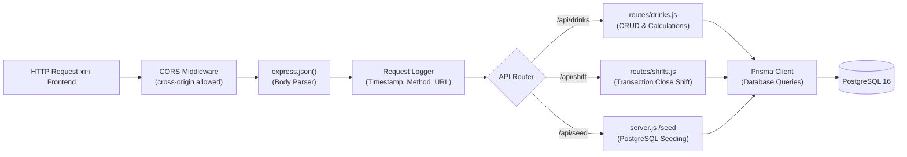

# 20.3 - สถาปัตยกรรมฝั่ง Backend (Node.js + Express.js)

[[20.2 - Frontend Architecture (React + Vite)|⬅️ ก่อนหน้า: สถาปัตยกรรมฝั่ง Frontend]] | [[20.4 - Docker & Container Orchestration|ถัดไป: คอนเทนเนอร์ Docker ➡️]]

---

## 1. ลำดับการประมวลผล (Express Middleware Pipeline)

แอปพลิเคชันฝั่งเซิร์ฟเวอร์รันบน Node.js (ES Modules) ร่วมกับ Express.js 4 โดยมีโครงสร้าง Pipeline ของ Request ดังนี้:



---

## 2. รายละเอียดข้อกำหนด API (RESTful API Specifications)

### 1. หมวดเครื่องดื่ม (Drink Items API):

| Method | Endpoint | หน้าที่การทำงาน | Request Body | Response ตัวอย่าง |
| :---: | :--- | :--- | :--- | :--- |
| **GET** | `/api/drinks` | ดึงรายการเครื่องดื่ม 41 รายการ พร้อมคำนวณยอด $(C, D, E)$ | ไม่มี | `{ success: true, data: [...] }` |
| **POST** | `/api/drinks` | สร้างรายการเครื่องดื่มใหม่ | `{ name, category, broughtForward }` | `{ success: true, data: { id, ... } }` |
| **PUT** | `/api/drinks/:id` | อัปเดตตัวเลขสต็อกขวดเดียว | `{ field: "cFront", value: 5 }` | `{ success: true, data: { ... } }` |
| **DELETE** | `/api/drinks/:id` | ลบรายการเครื่องดื่ม | ไม่มี | `{ success: true, message: "..." }` |

### 2. หมวดการปิดกะ (Shift Operations API):

| Method | Endpoint | หน้าที่การทำงาน | Request Body | Response ตัวอย่าง |
| :---: | :--- | :--- | :--- | :--- |
| **POST** | `/api/shift/close` | ปิดยอดประจำวันด้วย **PostgreSQL Transaction** | `{ shiftDate: "2026-09-27", notes: "" }` | `{ success: true, message: "...", data: shift }` |
| **GET** | `/api/shifts` | ดึงประวัติการปิดยอดที่ผ่านมาทั้งหมด | ไม่มี | `{ success: true, data: [...] }` |

### 3. หมวดเครื่องมือระบบ (System Seed API):

| Method | Endpoint | หน้าที่การทำงาน | Request Body | Response ตัวอย่าง |
| :---: | :--- | :--- | :--- | :--- |
| **POST** | `/api/seed` | ล้างและ Seed ข้อมูลเครื่องดื่ม Mockup 41 รายการ | ไม่มี | `{ success: true, message: "Seeded..." }` |
| **GET** | `/health` | ตรวจสอบสถานะการทำงานของเซิร์ฟเวอร์ | ไม่มี | `{ status: "ok", service: "..." }` |

---

## 3. การจัดการธุรกรรมฐานข้อมูล (Atomic Transaction Design)

การปิดยอดประจำวันใน `backend/routes/shifts.js` ถือเป็น Critical Operation ที่มีความเสี่ยงหากข้อมูลถูกเขียนไม่ครบถ้วน เซิร์ฟเวอร์จึงใช้ `prisma.$transaction` เพื่อควบคุมกระบวนการทั้งหมดให้เป็นก้อนเดียว (All-or-Nothing):

```javascript
const shift = await prisma.$transaction(async (tx) => {
  // ขั้นตอนที่ 1: สร้างหัวบิลสรุปประวัติกะ
  const newShift = await tx.dailyShift.create({
    data: { shiftDate, totalSold, totalOpenStock, totalCloseStock, warningCount, notes }
  });

  // ขั้นตอนที่ 2: บันทึก Snapshot รายขวด
  for (const drink of currentDrinks) {
    const cTotal = drink.cFront + drink.cBack;
    const dTotal = drink.dFront + drink.dBack;
    const sold = cTotal - dTotal;

    await tx.shiftRecord.create({
      data: { shiftId: newShift.id, drinkId: drink.id, drinkName: drink.name, category: drink.category, broughtForward: drink.broughtForward, added: drink.added, cTotal, dTotal, sold }
    });

    // ขั้นตอนที่ 3: ยกยอดคงเหลือร้านปิด (D) ไปเป็นยอดยกมา (A) ของวันใหม่ และล้างค่าช่องอื่น
    await tx.drinkItem.update({
      where: { id: drink.id },
      data: {
        broughtForward: dTotal, // (A) = (D)
        added: 0, cFront: 0, cBack: 0, dFront: 0, dBack: 0, remark: null,
      }
    });
  }

  return newShift;
});
```

> [!IMPORTANT]
> หากขั้นตอนใดขั้นตอนหนึ่งเกิดล้มเหลว (เช่น ไฟฟ้าดับระหว่างประมวลผล) ฐานข้อมูล PostgreSQL จะทำการ **Rollback** ยกเลิกการเปลี่ยนแปลงทั้งหมดทันที ข้อมูลสต็อกจะไม่เกิดความเสียหายเด็ดขาด

---

## 4. มาตรฐานรหัสสถานะการตอบกลับ (HTTP Status Codes)

- **`200 OK`**: คำขอสำเร็จ (GET, PUT, DELETE, Close Shift)
- **`201 Created`**: สร้างรายการเครื่องดื่มใหม่สำเร็จ (POST)
- **`400 Bad Request`**: ข้อมูลที่ส่งมาไม่ถูกต้อง (เช่น ขาดฟิลด์ที่จำเป็น)
- **`404 Not Found`**: ไม่พบรายการเครื่องดื่มตาม `id` ที่ระบุ
- **`500 Internal Server Error`**: เกิดข้อผิดพลาดฝั่งเซิร์ฟเวอร์หรือฐานข้อมูล
