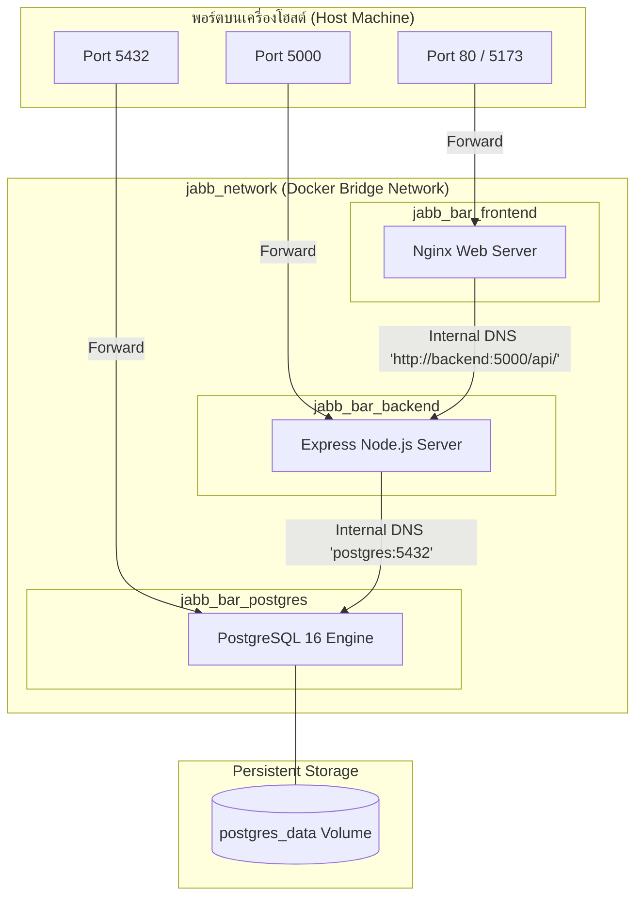

# 20.4 - การจัดการคอนเทนเนอร์ด้วย Docker (Docker & Container Orchestration)

[[20.3 - Backend Architecture (Node.js + Express)|⬅️ ก่อนหน้า: สถาปัตยกรรมฝั่ง Backend]] | [[30.1 - Entity-Relationship Diagram (ERD)|ถัดไป: แผนภาพ ERD ฐานข้อมูล ➡️]]

---

## 1. แผนผังคอนเทนเนอร์และเครือข่าย (Docker Compose Infrastructure)

ระบบจัดการสต็อกร้านจ๊าบบาร์ใช้ **Docker Compose** ในการควบคุมการทำงานของ 3 คอนเทนเนอร์หลัก โดยสื่อสารกันผ่านเครือข่ายเสมือน **`jabb_network` (Bridge Network)**:



---

## 2. รายละเอียดการทำงานของแต่ละคอนเทนเนอร์ (Service Specifications)

### 1. `postgres` (ฐานข้อมูล PostgreSQL):
- **Image:** `postgres:16-alpine` (ขนาดเล็ก ประหยัดแรม)
- **Healthcheck:**
  ```yaml
  test: ["CMD-SHELL", "pg_isready -U jabb_user -d jabb_bar_db"]
  interval: 5s
  timeout: 5s
  retries: 5
  ```
  *ทำหน้าที่ตรวจสอบว่า Database พร้อมรับการเชื่อมต่อจริง ก่อนที่ Backend จะเริ่มทำงาน*
- **Persistent Volume:** ผูกกับ `postgres_data:/var/lib/postgresql/data` เพื่อรับประกันว่าข้อมูลสต็อกจะไม่สูญหายเมื่อหยุด Container

### 2. `backend` (เซิร์ฟเวอร์ Express + Prisma):
- **Dockerfile:** ใช้ Base image `node:20-alpine` พร้อมติดตั้ง `openssl` สำหรับ Prisma Engine
- **Dependencies Control:**
  `depends_on: postgres: condition: service_healthy`
- **Auto Sync & Seed Entrypoint:**
  ```dockerfile
  CMD ["sh", "-c", "npx prisma db push && node prisma/seed.js && node server.js"]
  ```
  *เมื่อคอนเทนเนอร์เริ่มต้น จะรันการสร้างตารางและ Seed ข้อมูลเครื่องดื่ม Mockup 41 รายการเข้า PostgreSQL โดยอัตโนมัติ*

### 3. `frontend` (เว็บแอปพลิเคชัน React + Vite):
- **Multi-Stage Build Pattern:**
  - **Stage 1 (Builder):** ติดตั้งแพ็กเกจและรัน `npm run build` เพื่อแปลง JSX และ Tailwind เป็น Static HTML/JS/CSS ในโฟลเดอร์ `dist/`
  - **Stage 2 (Production Server):** คัดลอกเฉพาะโฟลเดอร์ `dist/` ไปวางใน `nginx:alpine` ขนาดเบาเพียง 25 MB
- **Nginx Reverse Proxy (`frontend/nginx.conf`):**
  - เสิร์ฟไฟล์หน้าเว็บ Single Page Application (`try_files $uri /index.html`)
  - ส่งต่อคำขอ API (`/api/`) ไปยังคอนเทนเนอร์ Backend โดยตรงผ่าน Internal Docker DNS (`http://backend:5000/api/`) โดยที่เบราว์เซอร์ไม่ต้องกังวลเรื่อง CORS

---

## 3. สรุปพอร์ตและจุดเชื่อมต่อ (Port Mapping Table)

| Service Container | Internal Port | Host Port | หน้าที่การใช้งาน |
| :--- | :---: | :---: | :--- |
| **`jabb_bar_frontend`** | `80` | `80`, `5173` | เข้าชมหน้าเว็บแอปนับสต็อกผ่านเบราว์เซอร์ |
| **`jabb_bar_backend`** | `5000` | `5000` | เข้าถึง Express RESTful API |
| **`jabb_bar_postgres`** | `5432` | `5432` | เชื่อมต่อผ่าน Database GUI เช่น DBeaver หรือ pgAdmin |

---

## 4. วงจรชีวิตและคำสั่งจัดการ (Lifecycle Management Commands)

```bash
# 1. บิลด์ Image และเริ่มรันทุกคอนเทนเนอร์ในโหมด Background
docker compose up --build -d

# 2. ตรวจสอบสถานะคอนเทนเนอร์
docker compose ps

# 3. ตรวจสอบบันทึกการทำงาน (Logs)
docker compose logs -f backend

# 4. สั่งรันคำสั่งภายในคอนเทนเนอร์ (เช่น สั่ง Seed ข้อมูลใหม่)
docker compose exec backend node prisma/seed.js

# 5. หยุดและลบคอนเทนเนอร์ (โดยข้อมูลใน Volume ยังคงอยู่)
docker compose down

# 6. หยุดและลบข้อมูลใน Volume ทั้งหมด (Factory Reset)
docker compose down -v
```
