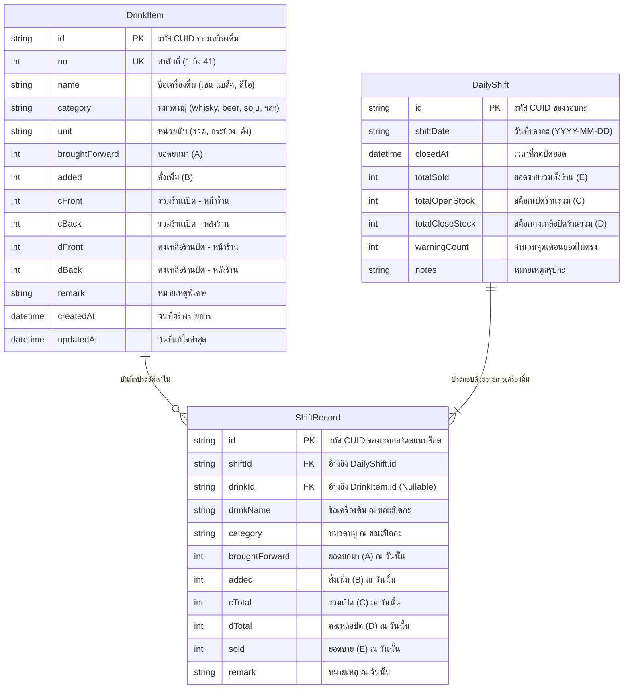

# 30.1 - แผนภาพความสัมพันธ์เชิงเอนทิตี (Entity-Relationship Diagram - ERD)

[[20.4 - Docker & Container Orchestration|⬅️ ก่อนหน้า: คอนเทนเนอร์ Docker]] | [[30.2 - Data Dictionary & Tables|ถัดไป: พจนานุกรมข้อมูล ➡️]]

---

## 1. แผนภาพ ER Diagram (Mermaid ERD)

ฐานข้อมูลของร้านจ๊าบบาร์บน PostgreSQL ได้รับการออกแบบให้รองรับทั้ง **การนับสต็อกแบบปัจจุบัน (Current Operational State)** และ **การบันทึกประวัติการปิดยอดในอดีต (Historical Snapshots)** เพื่อให้เจ้าของร้านสามารถตรวจสอบย้อนหลังได้ทุกวัน:

---

## 2. เหตุผลและหลักการออกแบบฐานข้อมูล (Design Rationale)

1. **การแยก Current State กับ Snapshot History:**
   - ตาราง `DrinkItem` จะถูกอัปเดตตลอดเวลาเมื่อมีการนับขวดหรือปิดยอดกะ
   - แต่ตาราง `DailyShift` และ `ShiftRecord` จะทำหน้าที่เป็น **Immutable Snapshot (ข้อมูลประวัติที่ไม่ถูกแก้ไข)** ทุกครั้งที่มีการกดปิดยอดประจำวัน
2. **การรักษาข้อมูลในอดีต (Referential Integrity with `SetNull`):**
   - หากในอนาคตทางร้านมีการลบรายการสินค้าใน `DrinkItem` (เช่น เลิกขายเบียร์บางยี่ห้อ) คีย์ `drinkId` ในตาราง `ShiftRecord` จะถูกเปลี่ยนเป็น `NULL` (`onDelete: SetNull`) แต่ชื่อสินค้า `drinkName` และตัวเลขยอดขายในอดีตจะยังคงถูกเก็บรักษาไว้อย่างสมบูรณ์ ไม่สูญหาย
3. **ประสิทธิภาพในการสืบค้น (Indexing & Ordering):**
   - ฟิลด์ `DrinkItem.no` ถูกกำหนดให้เป็น **Unique Constraint** เพื่อรับประกันความถูกต้องของการเรียงลำดับเครื่องดื่มบนหน้าเว็บ
   - ฟิลด์ `DailyShift.closedAt` ถูกทำ Index เพื่อให้การดึงประวัติกะย้อนหลังทำได้อย่างรวดเร็ว
