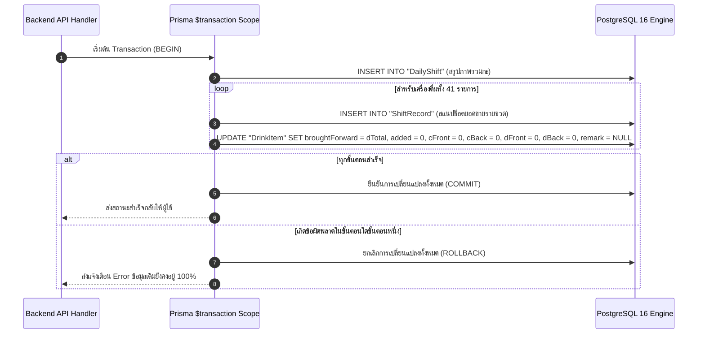

# 30.3 - การใช้งาน Prisma ORM และการออกแบบธุรกรรม (Prisma ORM & Transaction Design)

[[30.2 - Data Dictionary & Tables|⬅️ ก่อนหน้า: พจนานุกรมข้อมูล]] | [[40.1 - Daily Stock Counting & Shift Closing|ถัดไป: คู่มือนับสต็อกประจำวัน ➡️]]

---

## 1. การกำหนดค่า Schema (`backend/prisma/schema.prisma`)

Prisma ORM ทำหน้าที่เป็น Type-Safe Database Client และ Schema Manager โดยเชื่อมต่อกับ PostgreSQL ผ่าน Environment Variable `DATABASE_URL`:

```prisma
generator client {
  provider = "prisma-client-js"
}

datasource db {
  provider = "postgresql"
  url      = env("DATABASE_URL")
}

model DrinkItem {
  id             String        @id @default(cuid())
  no             Int           @unique
  name           String
  category       String
  unit           String        @default("ขวด")
  broughtForward Int           @default(0)
  added          Int           @default(0)
  cFront         Int           @default(0)
  cBack          Int           @default(0)
  dFront         Int           @default(0)
  dBack          Int           @default(0)
  remark         String?
  createdAt      DateTime      @default(now())
  updatedAt      DateTime      @updatedAt

  shiftRecords   ShiftRecord[]
}

model DailyShift {
  id              String        @id @default(cuid())
  shiftDate       String
  closedAt        DateTime      @default(now())
  totalSold       Int           @default(0)
  totalOpenStock  Int           @default(0)
  totalCloseStock Int           @default(0)
  warningCount    Int           @default(0)
  notes           String?

  records         ShiftRecord[]
}

model ShiftRecord {
  id             String     @id @default(cuid())
  shiftId        String
  shift          DailyShift @relation(fields: [shiftId], references: [id], onDelete: Cascade)
  drinkId        String?
  drink          DrinkItem? @relation(fields: [drinkId], references: [id], onDelete: SetNull)

  drinkName      String
  category       String
  broughtForward Int
  added          Int
  cTotal         Int
  dTotal         Int
  sold           Int
  remark         String?
}
```

---

## 2. การออกแบบธุรกรรมแบบอะตอมมิก (Atomic Next Day Shift Transaction)

ในระบบบาร์ การกดปุ่ม **"ปิดยอดประจำวัน"** มีความสำคัญอย่างยิ่ง เพราะต้องทำการบันทึกประวัติเก่า พร้อมกับเปลี่ยนแปลงสต็อกของวันใหม่ หากเซิร์ฟเวอร์เกิดขัดข้องกลางคัน อาจทำให้สต็อกหายไปได้

ระบบจึงใช้ฟีเจอร์ **Interactive Transactions (`prisma.$transaction`)** เพื่อรับประกันความสอดคล้องตามคุณสมบัติ ACID:



---

## 3. สคริปต์ Seed ข้อมูล Mockup 41 รายการ (`backend/prisma/seed.js`)

สคริปต์ Seeding ถูกออกแบบให้ทำงานแบบ Idempotent สามารถรันซ้ำเมื่อใดก็ได้เพื่อคืนค่าเริ่มต้น:
1. ล้างตารางเดิมตามลำดับเพื่อไม่ให้ติด Foreign Key: `ShiftRecord` ➔ `DailyShift` ➔ `DrinkItem`
2. บันทึกเครื่องดื่ม 41 รายการพร้อมเลขลำดับ `no: 1..41`
3. คำนวณยอดรวมเปิดร้าน, คงเหลือปิดร้าน และยอดขายตัวอย่าง
4. สร้าง `DailyShift` ตัวอย่างเพื่อให้นักพัฒนาเห็นข้อมูลประวัติทันทีหลัง Deploy

```bash
# คำสั่งรัน Seed บนเครื่องโฮสต์
cd backend && npm run db:seed

# คำสั่งรัน Seed ผ่าน Docker
docker compose exec backend node prisma/seed.js
```

---

## 4. คำสั่งจัดการฐานข้อมูล Prisma (CLI Reference)

| คำสั่ง | คำอธิบาย |
| :--- | :--- |
| **`npx prisma db push`** | ซิงค์โครงสร้างใน `schema.prisma` ไปยัง PostgreSQL โดยตรง เหมาะกับการพัฒนาที่รวดเร็ว |
| **`npx prisma generate`** | อัปเดต TypeScript/JavaScript Client ให้ตรงกับโมเดลใน Schema |
| **`npx prisma studio`** | เปิดหน้าต่างเว็บ GUI (พอร์ต 5555) เพื่อดู ตรวจสอบ และแก้ไขข้อมูลในตารางได้อย่างง่ายดาย |
| **`node prisma/seed.js`** | รันสคริปต์บรรจุข้อมูล Mockup เครื่องดื่ม 41 รายการ |
