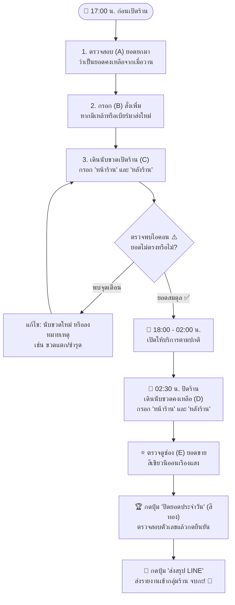

# 40.1 - คู่มือการนับสต็อกและการปิดยอดประจำวัน (Daily Operations Manual)

[[30.3 - Prisma ORM & Transaction Design|⬅️ ก่อนหน้า: สถาปัตยกรรม Prisma ORM]] | [[40.2 - Docker Operations & Troubleshooting|ถัดไป: คู่มือการใช้ Docker ➡️]]

---

## 1. ลำดับขั้นตอนการปฏิบัติงานประจำกะ (Daily Shift Workflow)



---

## 2. วิธีการอ่านและจัดการจุดเตือนสต็อกไม่ตรง (Warning Handling SOP)

เมื่อระบบแสดงไอคอน **⚠️ (สีส้มแดงกะพริบ)** แถวยอดรวมร้านเปิด $(C)$:

### สาเหตุที่เกิดขึ้นได้:
1. **ยอดเปิดจริง $(C)$ น้อยกว่าสต็อกที่มี $(A+B)$:**
   - *ตัวอย่าง:* ยอดยกมา 6 ขวด + สั่งเพิ่ม 2 ขวด = ควรมี 8 ขวด แต่นับหน้าร้าน+หลังร้านได้ 7 ขวด (ขาดไป 1 ขวด)
   - *การแก้ไข:* ตรวจสอบว่ามีขวดแตกชำรุดระหว่างวันหรือไม่ หรือมีใครนำไปเปิดใช้ก่อนเริ่มนับ หากสูญหายให้พิมพ์ลงในช่อง **"หมายเหตุ"** เช่น *"ขาด 1 ขวด ขวดแตกก่อนเปิดร้าน"*
2. **ยอดเปิดจริง $(C)$ มากกว่าสต็อกที่มี $(A+B)$:**
   - *ตัวอย่าง:* ยอดยกมา 4 ขวด สั่งเพิ่ม 0 แต่นับเปิดร้านได้ 5 ขวด (เกินมา 1 ขวด)
   - *การแก้ไข:* มีการสั่งสินค้าเข้ามาใหม่แต่ลืมกรอกในช่อง **(B) สั่งเพิ่ม** ให้ตรวจสอบบิลส่งของแล้วกรอกยอดสั่งเพิ่มให้ถูกต้อง ไอคอนแจ้งเตือนจะหายไปทันที

---

## 3. ขั้นตอนการกดปิดยอดประจำวัน (Next Day Shift Closing)

1. เมื่อนับยอด **(D) คงเหลือร้านปิด** ครบทุกรายการแล้ว ให้ตรวจเช็คยอดขายรวมที่การ์ดสรุปด้านบน
2. คลิกปุ่มสีทอง **"ปิดยอดประจำวัน" (Next Day Shift)** บริเวณมุมบนขวา
3. หน้าต่างยืนยันจะแสดงผลสรุป:
   - รอบวันที่ที่กำลังจะปิด
   - ยอดขายรวมที่ทำได้ (จำนวนขวด)
   - รายการสินค้าขายดี 5 อันดับแรก
   - ยอดคงเหลือรวมที่จะถูกยกไปเป็นสต็อกเปิดของวันพรุ่งนี้
4. กดปุ่ม **"ยืนยันปิดยอดและยกยอดไปวันใหม่"**
5. ระบบจะจุดพลุฉลอง 🎉 และดำเนินการ:
   - นำค่าจากช่องคงเหลือปิดร้าน $(D)$ ไปใส่แทนที่ในช่องยอดยกมา $(A)$
   - ล้างค่าช่อง (B), (C), (D) และหมายเหตุให้เป็นค่าว่าง
   - เลื่อนวันที่กะไปข้างหน้า 1 วันโดยอัตโนมัติ

---

## 4. การส่งรายงานสรุปยอดเข้ากลุ่ม LINE (LINE Report)

1. กดปุ่ม **"ส่งสรุป LINE"** ที่แถบเมนูด้านบน
2. คลิกปุ่ม **"คัดลอกสรุปส่ง LINE"**
3. ระบบจะคัดลอกข้อความรูปแบบมาตรฐานลง Clipboard:
   ```text
   📊 รายงานสรุปสต็อกเครื่องดื่ม ร้านจ๊าบบาร์ (JABB BAR)
   📅 ประจำวันที่: วันเสาร์ที่ 27 กันยายน 2569 (2026-09-27)
   ⏰ เวลาที่สรุป: 02:45:10
   --------------------------------
   🔥 ยอดขายรวมทั้งหมด: 48 ขวด/หน่วย
   📦 สต็อกเปิดร้านรวม: 759 หน่วย
   🔒 คงเหลือร้านปิดรวม: 711 หน่วย
   --------------------------------
   🏆 รายการที่มียอดขาย (9 รายการ):
   1. ลีโอ: 18 ขวด
   2. สิงห์: 12 ขวด
   3. รีเจนซี่ แบน: 8 ขวด
   4. โซดา: 6 ขวด
   5. แบล็ค: 4 ขวด
   --------------------------------
   บันทึกโดย: ระบบสต็อกจ๊าบบาร์ โหมดกลางคืน 🍸
   ```
4. เปิดแอป LINE และกดวาง (Paste) ส่งเข้ากลุ่มผู้จัดการร้านได้ทันทีใน 3 วินาที!
